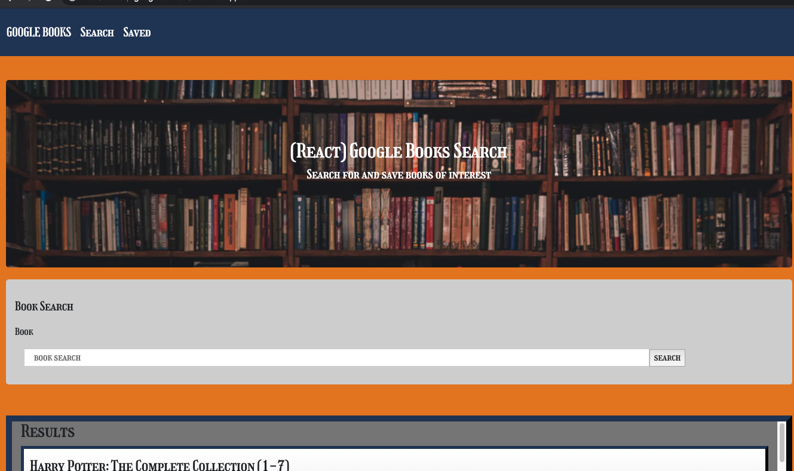
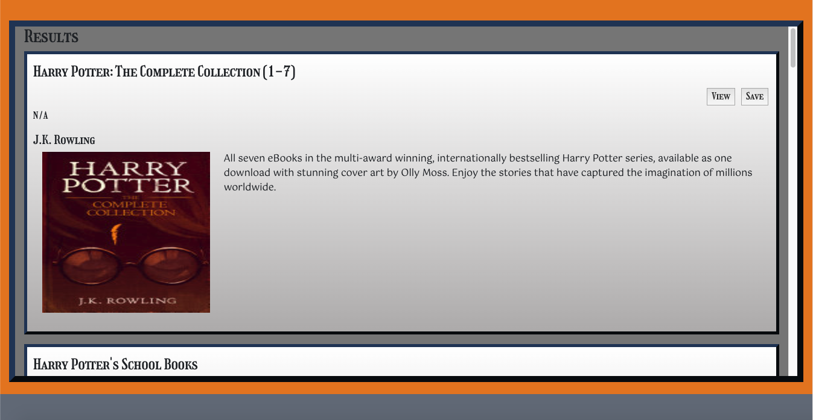
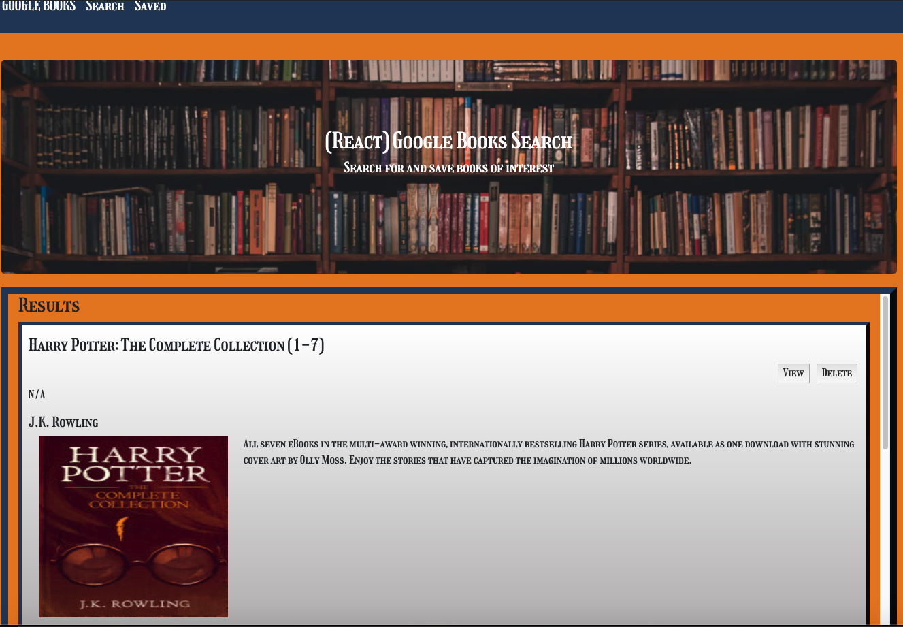

# Google-Books
A full MERN stack application retrieving books form the google book api based on user search. A react router is used to switch from page to page. Bootstrap on the front end and mongo db on the backend. It brings back a list of book from teh google books api and maps through them putting them on the page with the author, title, image and description. You can click the view link to go to the google books link or click the save button to save the book information to a database. Thee is a saved books page where a get request is preformed and list the books you saved to the database. You can delete frm his page as well. 

Link:https://googlebooks232.herokuapp.com/

